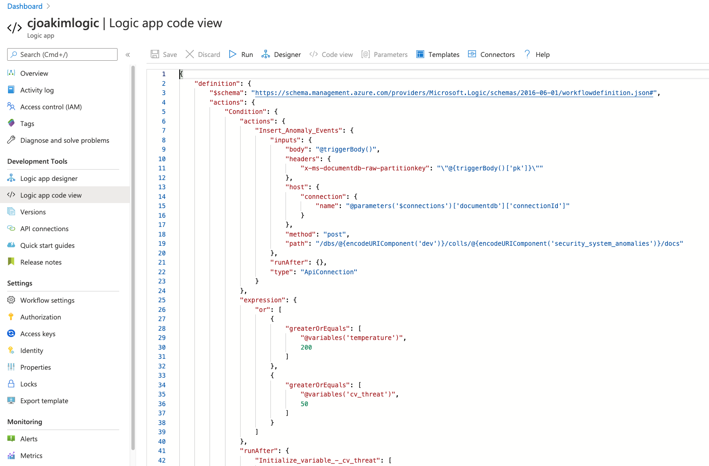
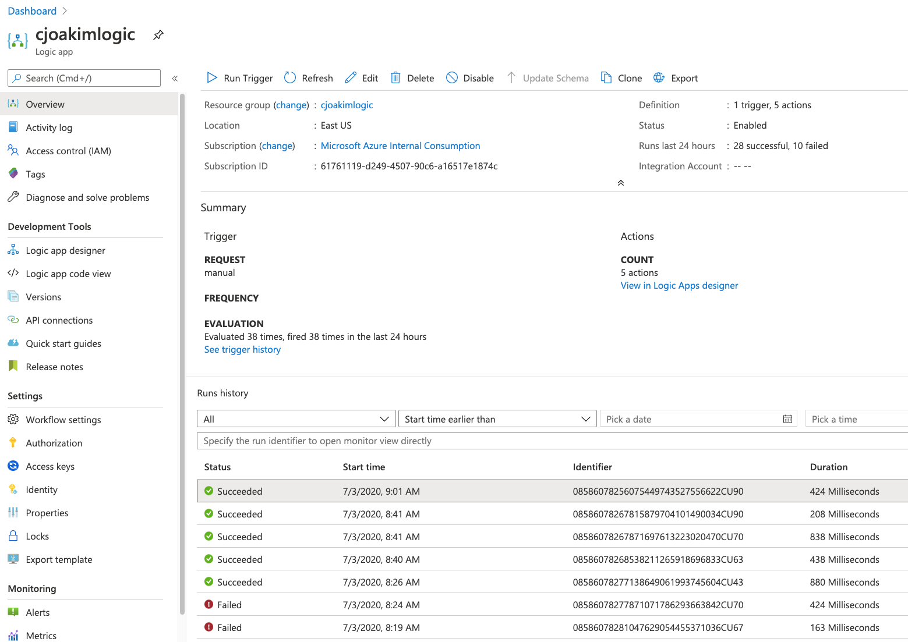
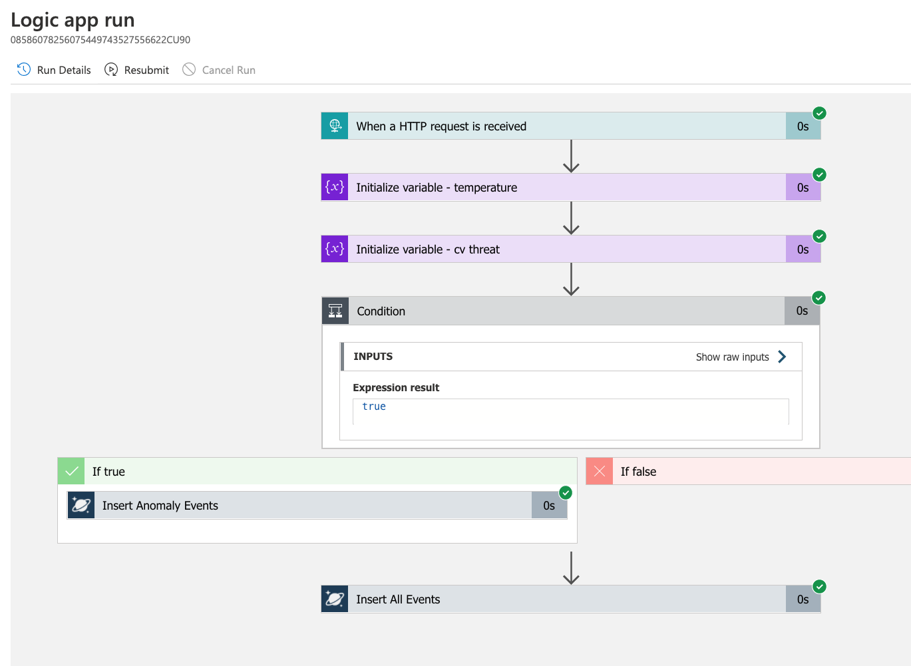

# azure-logicapp-cosmosdb

Simple HTTP-triggered Azure Logic App that writes to CosmosDB.

Example app is a simulated Home Security System.

---

## What are Azure Logic Apps?

TODO

---

## This Example App - a  Home Security System

- **Home security device captures sensor data** periodically, including **temperature** and **cv_threat**
- Home security device **HTTP POSTs heartbeat JSON messages**, with this data, to the Azure Logic App
  - A Python client in this repo creates and POSTs randomized messages
- Logic in the **Azure Logic App determines if the heartbeat is an anomaly**
- Logic App saves all messages to the **CosmosDB 'security_system_all' container**
- Logic App saves the anomalies to the **CosmosDB 'security_system_anomalies' container**

- The Logic App can be extended to send emails, put messages on a queue, etc
- The Logic App can be extended to invoke Cognitive Services or other web services, etc 

---

## The Azure Logic App

### Designer View

<p align="center">
  
</p>

### Code View

<p align="center">
  
</p>

---

## Python HTTP Client - Simulated Home Security System

Implemented in Python 3, creates and HTTP POSTs a JSON document with randomized data.

This code uses **environment variable AZURE_LOGICAPP_URL** - the URL of the Azure Logic App.

```
$ env | grep AZURE_LOGICAPP_URL
AZURE_LOGICAPP_URL=https://prod-47.eastus.logic.azure.com:443/workflows/64a0f2...........
```

### Setup your Python Virtual environment

#### Setup On Linux or macOS

In a Terminal window, run the following commands:

```
$ git clone https://github.com/cjoakim/azure-logicapp-cosmosdb.git   <-- clone this GitHub repository
$ cd azure-logicapp-cosmosdb
$ cd py                        <-- the python client program is in this directory
$ venv.sh create               <-- create a python virtual environment, libraries specified in requirements.in
$ source bin/activate          <-- activate the python virtual environment
```

#### Setup On Windows

In a PowerShell window, run the following commands:

```
$ git clone https://github.com/cjoakim/azure-logicapp-cosmosdb.git
$ cd azure-logicapp-cosmosdb
$ cd py

TODO 
```

### Execute the Client Program (any OS)

```
$ python security_system.py
...
body:    {
  "id": "214493f7-efa4-4701-bba9-a8c9bc9ee117",
  "pk": "1066613264658",
  "device_id": "1066613264658",
  "epoch": 1593781277,
  "temperature": 78,
  "cv_threat": 98,                             <-- ALERT!
  "name": "Danny Elliott",
  "address": "80817 Kelley Trail Mall",
  "city": "North Michael",
  "state": "NE",
  "doctype": "home_security_system_heartbeat",
  "info": "6.57.23"
}
...
```

The **cv_threat** value can be in the range from 0-99; 98 indicates than an intruder is in the house!
This message is definitely an anomaly, even though the **temperature** is in the normal range.

HTTP POSTing this JSON to the Azure Logic App will cause it to be triggered and execute.
When execution is completed, you'll see an entry in the following **Run History List**.

### Run History List

<p align="center">
  
</p>

You can click into an individual **Run History View**, and into its Steps to see the details for each step.

### Run History View

<p align="center">
  
</p>
