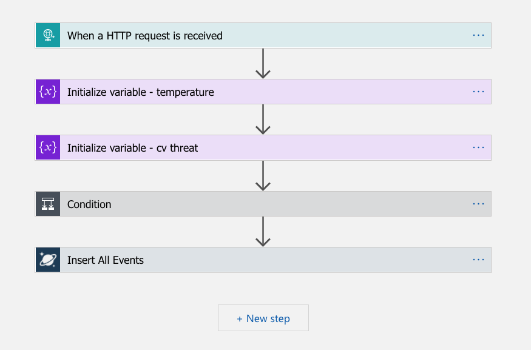
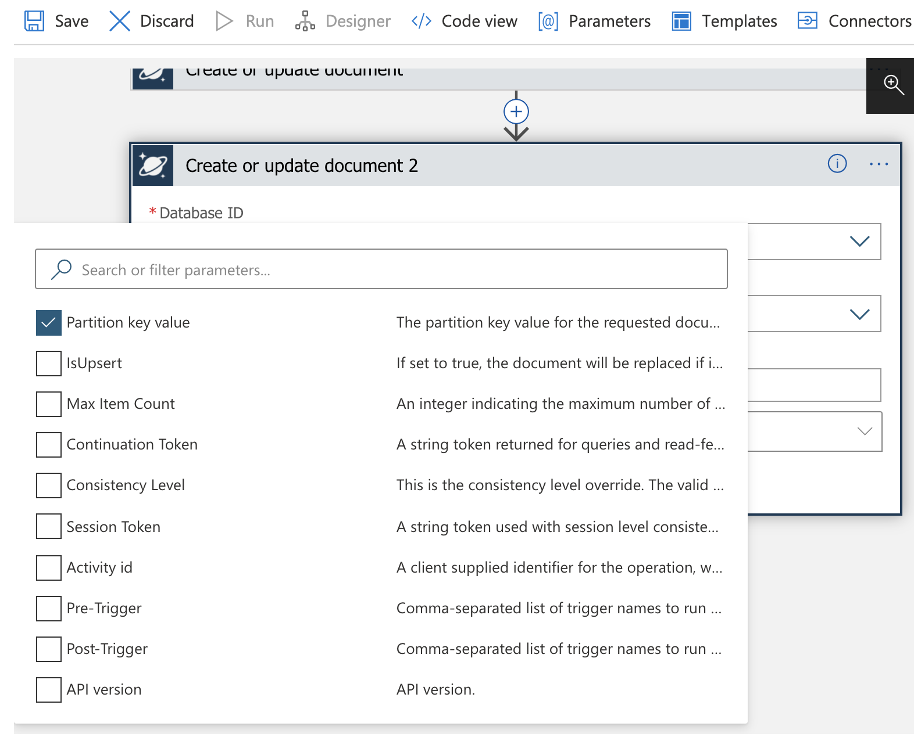
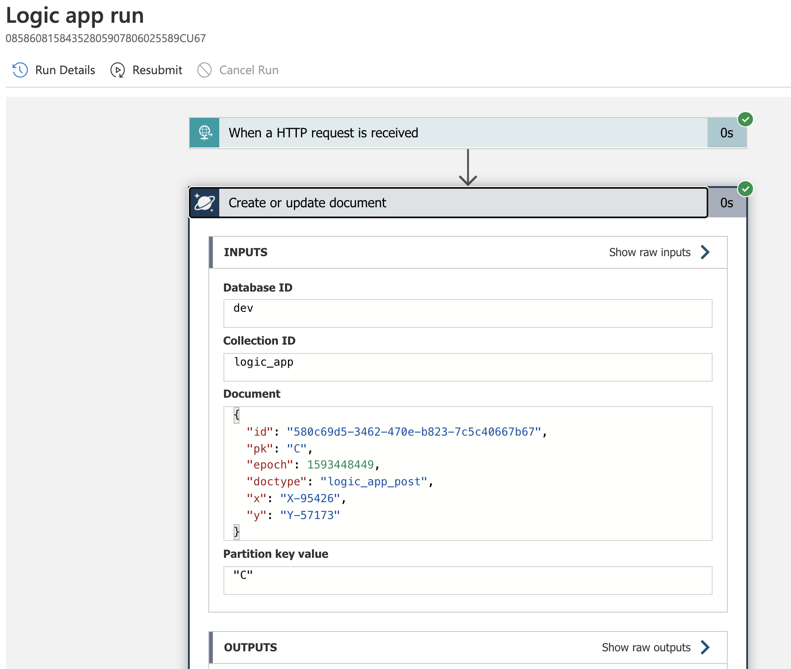
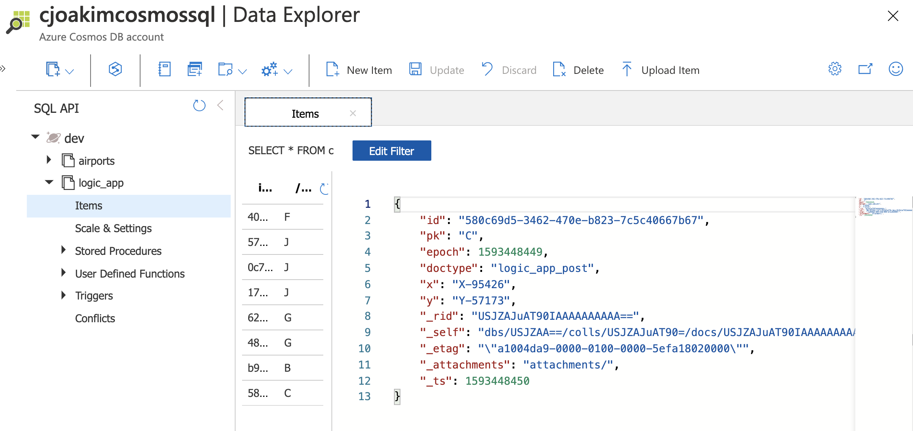

# azure-logicapp-cosmosdb

Simple HTTP-triggered Azure Logic App that writes to CosmosDB.

---

## HTTP Client 

Implemented in Python, creates and HTTP POSTs a randomized JSON document 
like the following to the Azure Logic App.

```
{
  "id": "580c69d5-3462-470e-b823-7c5c40667b67",
  "pk": "C",
  "epoch": 1593448449,
  "doctype": "logic_app_post",
  "x": "X-95426",
  "y": "Y-57173"
}
```

Note that an **id** uuid value is generated, as well as the **pk** - the CosmosDB
**partition key attribute name** for the target container.

### HTTP Client Setup and Execution

```
$ git clone https://github.com/cjoakim/azure-logicapp-cosmosdb.git   # <-- this repo
$ cd azure-logicapp-cosmosdb
$ cd py
$ ./venv.sh create                                # <-- create the python virtual environment with PyPI libs
$ source bin/activate                             # <-- activate the python virtual environment
$ python http_client.py invoke_http_logic_app     # <-- execute the program, post a doc to the Logic App
```

---

## Azure Logic App

The Logic App has just these two steps, and is triggered by a HTTP POST.

<p align="center">
  
</p>

### CosmosDB Configuration 

Target database named **dev** with a **logic_app** container, which has the partition key
attribute named **pk**.

### Initial Logic App Error relating to Partition Key

You may see the following error as you develop and execute your Logic App.

```
{
    "statusCode": 400,
    "headers": {
        "x-ms-last-state-change-utc": "Fri,26 Jun 2020 19:59:50.185 GMT",
        "lsn": "1",
        "x-ms-schemaversion": "1.9",
        "x-ms-quorum-acked-lsn": "1",
        "x-ms-substatus": "1001",
        "x-ms-current-write-quorum": "3",
        "x-ms-current-replica-set-size": "4",
        "x-ms-xp-role": "1",
        "x-ms-global-Committed-lsn": "1",
        "x-ms-number-of-read-regions": "0",
        "x-ms-transport-request-id": "1",
        "x-ms-cosmos-llsn": "1",
        "x-ms-cosmos-quorum-acked-llsn": "1",
        "x-ms-session-token": "0:1",
        "x-ms-request-charge": "0",
        "x-ms-serviceversion": "version=2.11.0.0",
        "x-ms-activity-id": "496a279d-ba5d-48ff-a7fc-85187cc10602",
        "Strict-Transport-Security": "max-age=31536000",
        "x-ms-gatewayversion": "version=2.11.0",
        "Timing-Allow-Origin": "*",
        "x-ms-apihub-cached-response": "true",
        "Date": "Mon, 29 Jun 2020 15:30:32 GMT",
        "Content-Length": "1170",
        "Content-Type": "application/json"
    },
    "body": {
        "code": "BadRequest",
        "message": "Message: {\"Errors\":[\"The partition key supplied in x-ms-partitionkey header has fewer components than defined in the the collection.\"...
    }
}
```

### Fix the Partition Key Issue in the Logic App

<p align="center">
  
</p>

Add a **CosmosDB Create or Update Document** step.  Be sure to check the **Partition key value**
setting as shown above.  The partition key value must be quoted, and this may be done
in the **Code View** as follows:

```
...
    "Create_or_update_document": {
        "inputs": {
            "body": "@triggerBody()",
            "headers": {
                "x-ms-documentdb-raw-partitionkey": "\"@{triggerBody()['pk']}\""
            },
...
```

See file [logicapp/code.json](logicapp/code.json) in this repository for the complete Logic App code.

---

### Successful Results 

You should see similar output in your Logic App Overview Runs History
in the Azure Portal UI.

<p align="center">
  
</p>

Likewise, the document should have been persisted to CosmosDB like this:

<p align="center">
  
</p>
