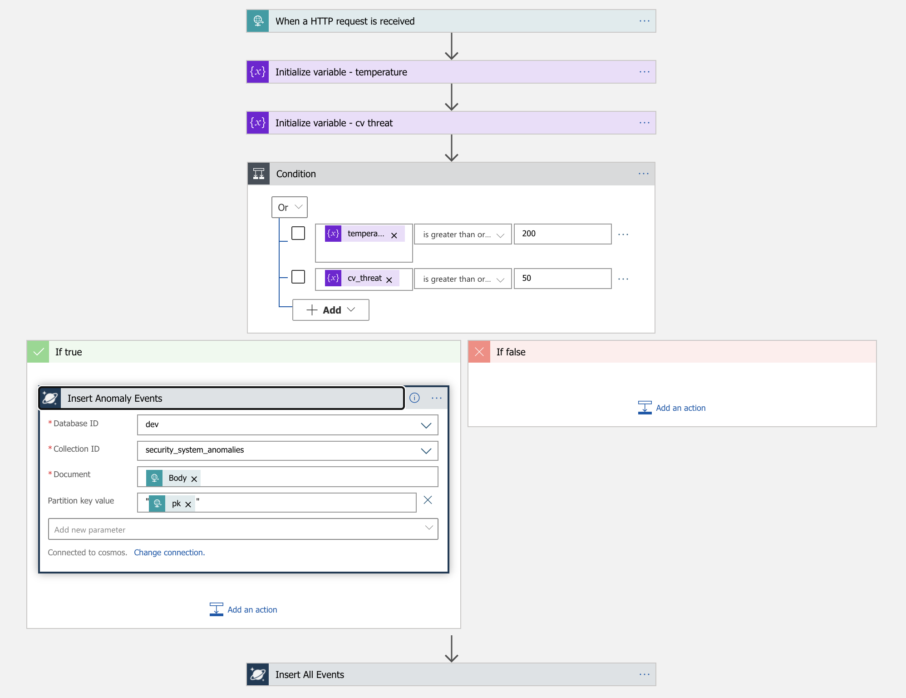

# azure-logicapp-cosmosdb

A simple HTTP-triggered Azure Logic App that writes to CosmosDB.

This example app is a **simulated Home Security System**.

Repos:
- https://github.com/cjoakim/azure-logicapp-cosmosdb  (This Repo, Simple Logic App)
- https://github.com/cjoakim/azure-logicapp-blob-aci-dotnet  (Logic App as "Orchestrator" for ACI)

---

## What are Azure Logic Apps?

- [Overview](https://docs.microsoft.com/en-us/azure/logic-apps/logic-apps-overview)
- [Triggers](https://docs.microsoft.com/en-us/azure/logic-apps/logic-apps-workflow-actions-triggers#trigger-types-list) - HTTP, Schedule, eMail, or other Connectors
- [Why?](https://docs.microsoft.com/en-us/azure/logic-apps/logic-apps-overview#why-use-logic-apps)
  - **"Low-Code / No-Code"** - can be developed by **Citizen Developers**
  - **Serverless** reliable managed PaaS service, no 24x7x365 VMs to maintain
  - **Event Driven** - (aka - Realtime, Reactive, Streaming, etc.)
  - [Many Connectors!](https://docs.microsoft.com/en-us/connectors/)
  - [Pricing](https://azure.microsoft.com/en-us/pricing/details/logic-apps/)
  - [BizTalk Migration](https://docs.microsoft.com/en-us/azure/logic-apps/logic-apps-move-from-mabs)
- [Documentation](https://docs.microsoft.com/en-us/azure/logic-apps/)
- [Expressions Reference](https://docs.microsoft.com/en-us/azure/logic-apps/workflow-definition-language-functions-reference) 

### Examples

- [Scheduled Workflow with Bing Maps Integration](https://docs.microsoft.com/en-us/azure/logic-apps/tutorial-build-schedule-recurring-logic-app-workflow)
- [Approval-Based Workflow](https://docs.microsoft.com/en-us/azure/logic-apps/tutorial-process-mailing-list-subscriptions-workflow)
- [Process Incoming Emails](https://docs.microsoft.com/en-us/azure/logic-apps/tutorial-process-email-attachments-workflow)

---

## This Example App - a  Home Security System

- **Home security device captures sensor data** periodically, including **temperature** and **cv_threat** (computer vision)
- Home security device **HTTP POSTs heartbeat JSON messages**, with this data, to the Azure Logic App.  A Python program in this repo creates and POSTs these randomized messages.
- Logic in the **Azure Logic App determines if the heartbeat is an anomaly**
- Logic App saves all messages to the **CosmosDB 'security_system_all' container**
- Logic App saves the anomalies to the **CosmosDB 'security_system_anomalies' container**

### Enhancements

- Send emails, put messages on a queue, etc. with [Logic App Connectors](https://docs.microsoft.com/en-us/azure/connectors/apis-list)
- Integrate with web services like [Azure Cognitive Services](https://docs.microsoft.com/en-us/azure/cognitive-services/) - Vision, Face, Text Analytics, etc

---

## The Azure Logic App

### Designer View, Compact

<p align="center">
  
</p>

### Designer View, Full

<p align="center">
  
</p>

### Code View

<p align="center">
  
</p>

[Code](logicapp/code.json)

---

## Python HTTP Client - Simulated Home Security System

Implemented in Python 3, creates and HTTP POSTs a JSON document with randomized data.

This code uses **environment variable AZURE_LOGICAPP_URL** - the URL of the Azure Logic App.

```
$ env | grep AZURE_LOGICAPP_URL
AZURE_LOGICAPP_URL=https://prod-47.eastus.logic.azure.com:443/workflows/64a0f2...........
```

### Setup your Python Virtual environment

#### Setup On Linux or macOS

In a Terminal window, run the following commands:

```
$ git clone https://github.com/cjoakim/azure-logicapp-cosmosdb.git   <-- clone this GitHub repository
$ cd azure-logicapp-cosmosdb
$ cd py                        <-- the python client program is in this directory
$ venv.sh create               <-- create a python virtual environment, libraries specified in requirements.in
$ source bin/activate          <-- activate the python virtual environment
```

#### Setup On Windows

In a PowerShell window, run the following commands:

```
$ git clone https://github.com/cjoakim/azure-logicapp-cosmosdb.git
$ cd azure-logicapp-cosmosdb
$ cd py
$ .\venv.ps1                   <-- create and activate the python virtual environment
```

### Execute the Client Program (any OS)

This program simulates an on-prem device in the home of the customer subscribing
to the home security service.

```
$ python security_system.py
...
body:    {
  "id": "214493f7-efa4-4701-bba9-a8c9bc9ee117",
  "pk": "1066613264658",
  "device_id": "1066613264658",
  "epoch": 1593781277,
  "temperature": 78,
  "cv_threat": 98,                             <-- Computer-Vision ALERT!
  "name": "Danny Elliott",
  "address": "80817 Kelley Trail Mall",
  "city": "North Michael",
  "state": "NE",
  "doctype": "home_security_system_heartbeat",
  "info": "6.57.23"
}
...
```

The **cv_threat** value can be in the range from 0-99; 98 indicates than an intruder is in the house!
This message is definitely an anomaly, even though the **temperature** is in the normal range.

HTTP POSTing this JSON to the Azure Logic App will cause it to be triggered and execute.
When execution is completed, you'll see an entry in the following **Run History List**.

Alternatively, override the randomized temperature and cv_threat on the command-line like this:
```
python security_system.py temp 514 cv 99
```

### Run History List

<p align="center">
  
</p>

You can click into an individual **Run History View**, and into its Steps to see the details for each step.

### Run History View

<p align="center">
  
</p>
